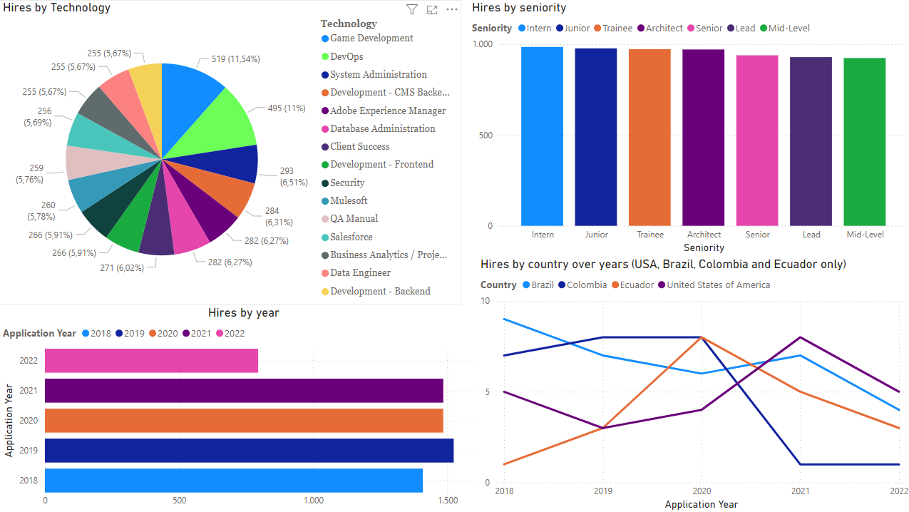

# Workshop1_ETL
A personal journey in Python Data Engineering. This repo documents my process of ETL, data analysis, and visualization with Python and databases, transforming candidate data into meaningful insights.

## Context

This repository contains my solution to the ETL Workshop, designed to simulate a real job interview scenario, providing practical experience in data management and visualization. Through this project, I had the opportunity to work with randomly generated candidate data, initially stored in a CSV file.

The main challenge was to migrate these data to a relational database and then create specific graphic visualizations to represent various metrics in a Dashboard, such as:

The distribution of hires by technology,
Hires by year,
Hires by seniority level, and
Hires by country over the years, focusing on the USA, Brazil, Colombia, and Ecuador.
For this workshop, I used Python and Jupyter Notebook, choosing to store the hired candidates in an appropriate cloud-hosted PostgreSQL database to manage the information.

To consider a candidate "hired" they had to have scores greater than or equal to 7 in both the code challenge and the technical interview.

### Dashboard

## Steps to Reproduce the Analysis

Setup the Environment:

- Install PostgreSQL and Power BI Desktop.
- Create a virtual environment and install the dependencies listed in requirements.txt.
- Configure the connection to the PostgreSQL database.

Data Preparation:

- Use the provided Python scripts (migration.py and analysis.ipynb) to clean the data and migrate it to PostgreSQL.

Data Visualization:

- Connect Power BI to the PostgreSQL database and generate the required visualizations as detailed in the challenge.